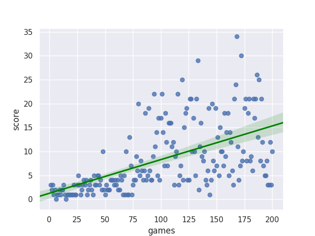
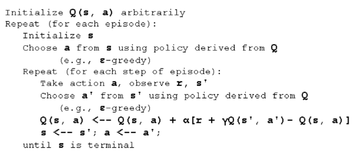

# snake-game
**Snake Game with Poison Fruit**

**Snake game Methodology Explanation** 
In this project, we are trying to controll the snake that moves freely into different directions and wants to eat fruits, candies. When snake eats a fruit, it grows in size and grows, but the game is over if snake eats poisonous fruits.  

**Q-learning algorithm with Keras as neural network models used**. 
The dependences of this game are on python, Keras, sci-kit image, and tensor flow. A part of the code in this game builds up with the CNN. Q-Learning algorithm goes on in which gamma parameter settled and initial matrix Q ended to zero. The maximum value of the Q depends upon the number of the state.
 
**Game running on the cluster**

GPU = 1 -C = 5

**First time running the game on cluster**

      

**After a few times training the game**

**The agent in the game trained with the SARSA algorithm. In
the game the algorithm trained based upon the SARSA algorithm using the following code**

    def train_short_memory(self, state, action, reward, next_state, done):
    target = reward

        if not done:
            target = reward + self.gamma *
    np.amax(self.model.predict(next_state.reshape((1, state_dim)))[0])
        target_f = self.model.predict(state.reshape((1, state_dim)))
        target_f[0][np.argmax(action)] = target
        self.model.fit(state.reshape((1, state_dim)), target_f, epochs=1, verbose=0)
    
Using the python code in the game the SARSA algorithm performed and it trained the agent
where the next action taken. The SARSA algorithm works in which the agent is in state S,
actions taken by the agent in which the reward R taken. The agent gets back to the state S to take
the next action A.

**State-Action-Reward-State-Action (SARSA) Algorithm and Reinforcement Learning**:

SARSA.png

