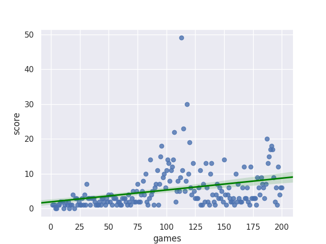

# snake-game
Snake Game with Poison Fruit

Snake game Methodology Explanation 
In this project, we are trying to controll the snake that moves freely into different directions and want to eat fruits, candies. When snake eats a fruit, it grows in size and grows, but the game is over if snake eats poisonous fruits.  

Q-learning algorithm with Keras as neural network models used. 
The dependences of this game are on python, Keras, sci-kit image, and tensor flow. A part of the code in this game builds up with the CNN. Q-Learning algorithm goes on in which gamma parameter settled and initial matrix Q ended to zero. The maximum value of the Q depends upon the number of the state.

Deep reinforcement learning algorithm using Keras performed. 
The snake game is codded in python using Pygame. D-Q learning performed instead of using the traditional approach of machine learning. Bellman equation used in which Q-values updated. 120 hidden neurons are used, and dropout layer used for the optimization. 
For the training of the game, State-Action-Reward-State applied. After the training of the data, testing of the game applied -- in the testing of the game, snake moving capabilities tested and tested until the game terminated.  

